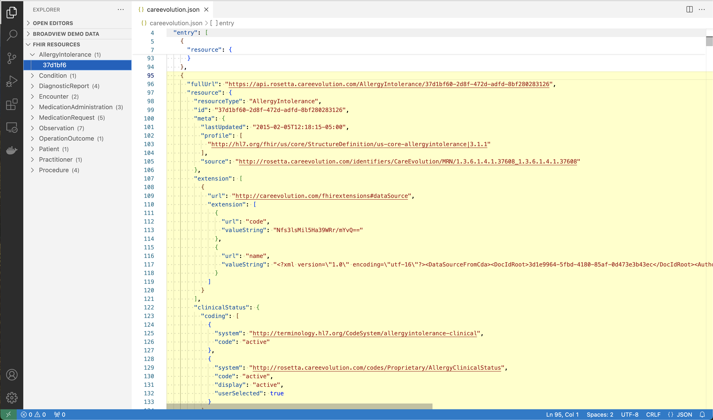

# FHIR Tools -- by CareEvolution

This extension provides some tools for working with FHIR bundles.

## Features

The tools currently available are:

- Minify bundle: Removes all the extraneous white space from a FHIR bundle, to make it as small as possible. This is useful if you're sending your bundle to an API that has a size limit.
- Compare bundles: Lines up 2 bundles side-by-side and orders each resource's properties so that you can see what is similar and what is different between them.

Use the command pallette to access these tools. 

In addition, this extension adds a tree view in the primary sidebar that shows you all of the individual resources that appear in the FHIR bundle. If you click on a resource identifier in the tree, we scroll to and highlight that resource in the bundle.

## Requirements

To compare 2 FHIR bundles, have them both open in editor tabs. 

## Known Issues

None currently.

## Release Notes

### 1.0.0

Initial release

## Contact Us
For questions or more information visit [CareEvolution](https://careevolution.com "CareEvolution") or email <info@careevolution.com>

**Enjoy!**
