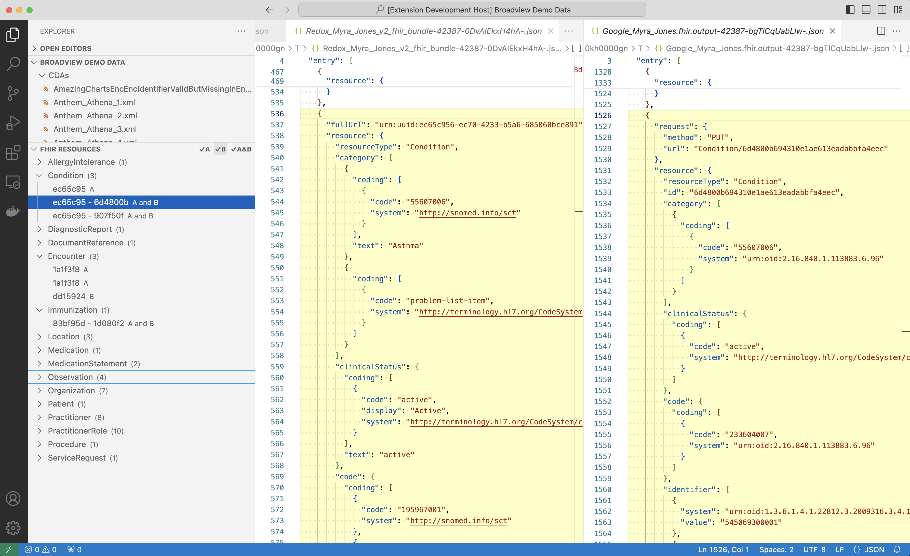

# CareEvolution FHIR Toolkit

This extension provides a toolkit for working with FHIR bundles.

## Features

This extension adds a FHIR Resources tree view to the primary sidebar. It shows you all of the resources that appear in the FHIR bundle in the active window. If you click on a resource identifier in the tree, we scroll to and highlight that resource in the bundle.

The extension includes the following commands accessed via the command palette (View -> Command Palette... or Ctrl + Shift + P): 

**FHIR: Compare active file with...**

Lines up 2 bundles side-by-side and sorts the resources and their properties so that you can compare them and see what is similar and what is different between them. To use this command do the following:

- Have both files that you want to compare (file A and file B) open in editor tabs.
- While file A is open in the active editor window, go to the command palette and type `FHIR: Compare active file with...`. 
- Select file B from the dropdown that appears when you select the command.
- Files A and B then appear side-by-side in 2 new editor tabs. They each scroll independently of the other.
- The FHIR Resources tree includes resources from both files, indicating which ones are in file A only, file B only, or in both A and B. Selecting a resource will scroll the appropriate file(s) to that resource and highlight it in yellow.
- You can filter the FHIR Resources tree using the buttons at the top to show resources that appear in file A only, file B only, or in both A and B.

**FHIR: Minify bundle**

Removes all the extraneous white space from a FHIR bundle to make it as small as possible. This is useful if you're sending your bundle to an API that has a size limit.

## Requirements

To compare 2 FHIR bundles, have them both open in editor tabs. 

## Known Issues

None currently.

## Release Notes

### 1.0.0

Initial release

## Contact Us
For questions or more information visit [CareEvolution](https://careevolution.com "CareEvolution") or email <info@careevolution.com>

**Enjoy!**
